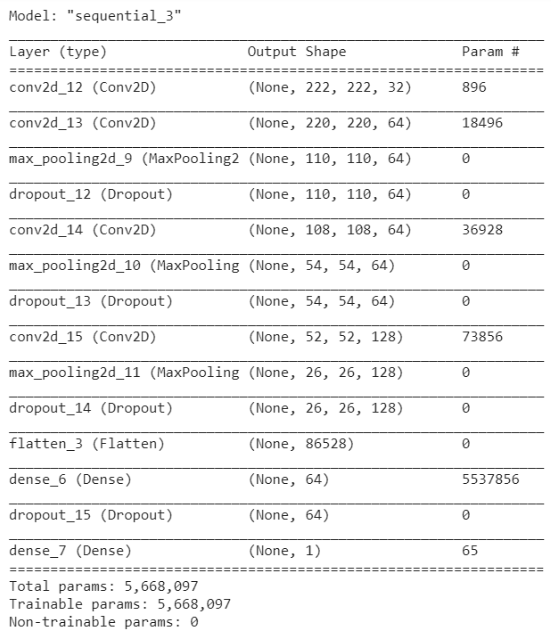
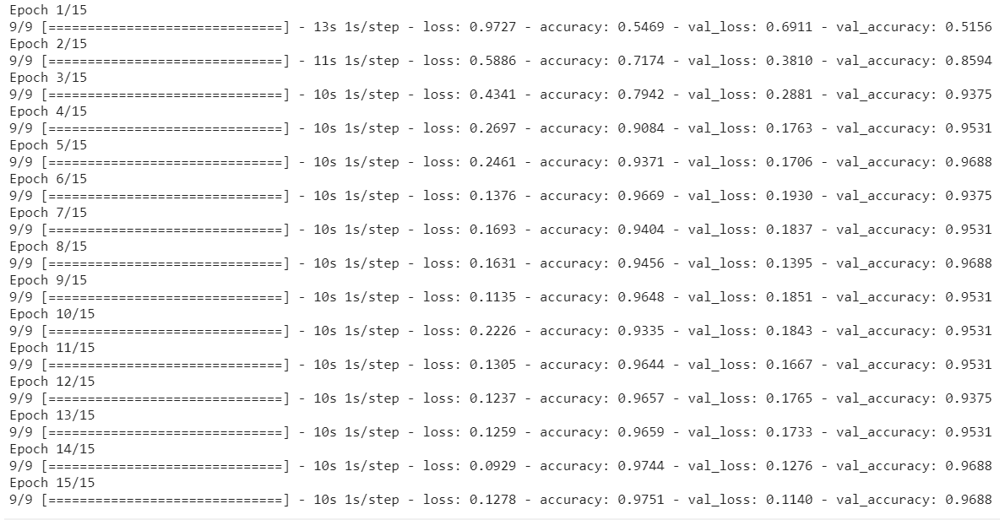
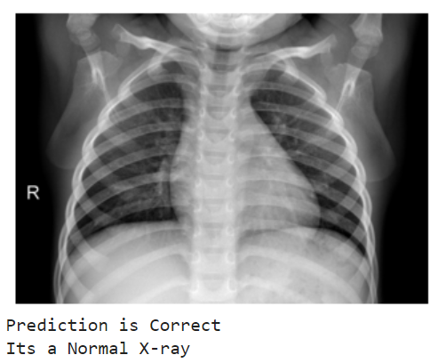
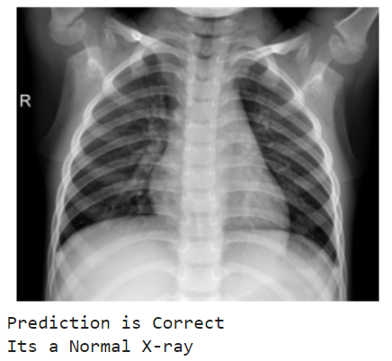
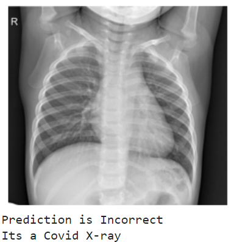
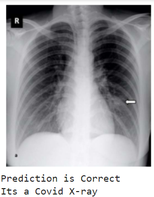
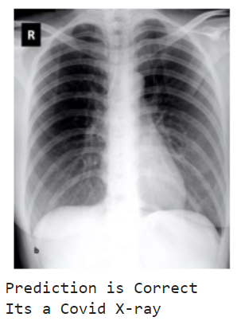
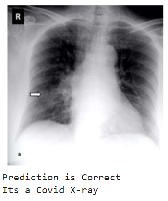

# COVID DETECTION USING X-RAYS

## Description

* Convolution neural network (CNN) based model for detection of COVID using X-ray Images.
* CNN models are very robust in distinguishing between COVID and NON-COVID Images with an accuracy of
  96.8%.
* Developed custom data preprocessing script.
* Implemented complete model architecture from scratch using Keras library.
* Visualising done using Matplotlib library.

## Model Architecture

* Keras Sequential model was used for Implementation of CNN.
* Starting with Conv2D layer of 32 filters and (3,3) kernel size with activation as 'relu'.
* Followed by Maxpooling and Dropout layers. 
* Repeated this flow with increasing filters and same kernel size as the receptive field would 
  increase.
* Lastly Dense layers were added and final layer with 1 neuron with 'sigmoid' as the activation.

 

## Training 

* Model was trained for 15 epochs. Images were feeded batch wise with batch size as 32.
* Binary cross entropy was used as loss with adam as optimizer and metric as Accuracy.
* After 15 epochs Train-accuracy reached around 97% and Val-accuracy around 96.8%.

## Visualising Results

* Images were tested and results were satisfactory. 
* Results were visualised using matplotlib.

## Future Work

* Feature differences between normal and covid X-rays can be visualised in a better way using 
  Grad-cam based techniques. 
* Creating U-I interface for Predictive analysis of Query Images. 
